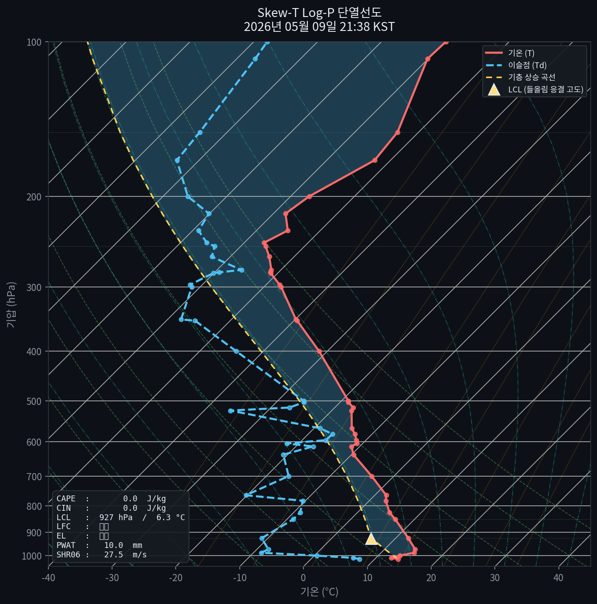
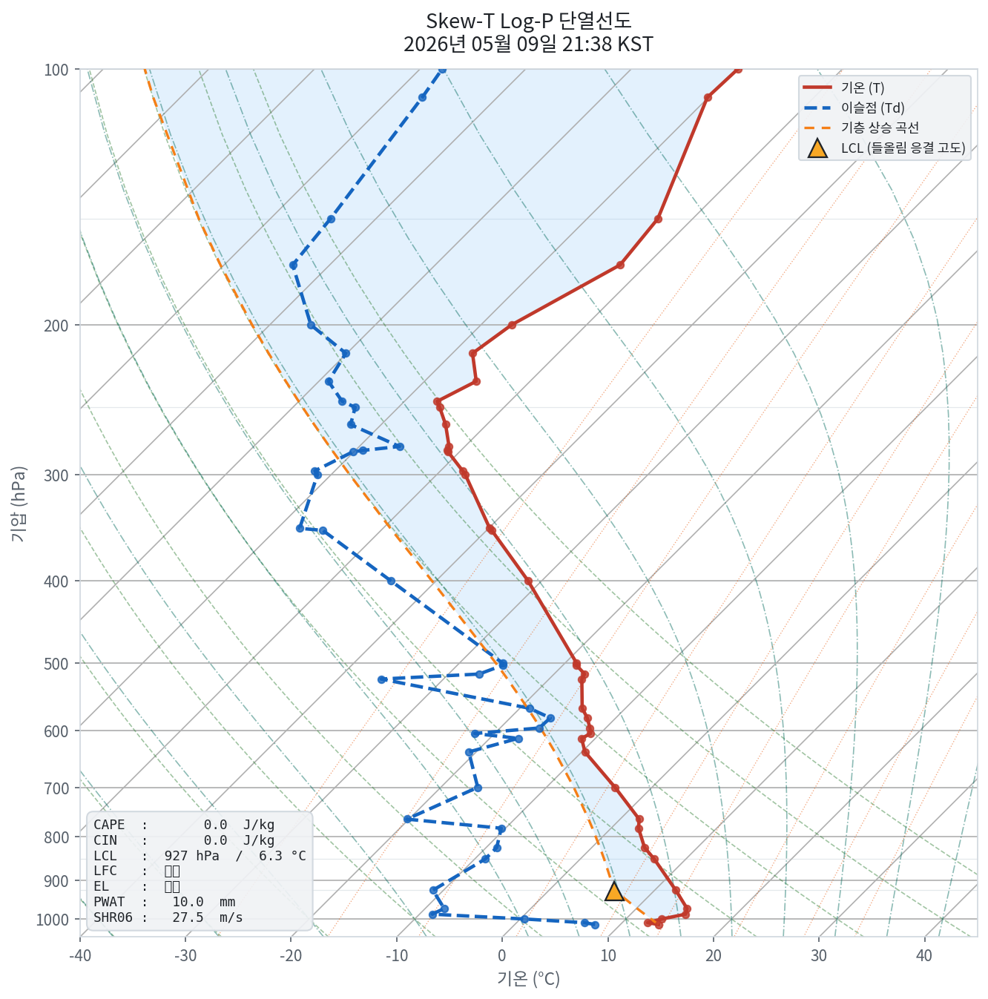

# ZONDE API Analyze
기상청 API 허브를 이용한 **Skew-T Log-P 단열선도** 자동 생성 프로젝트

...의 테스트 전용 레포 / 여러 기능들 임의로 추가하고 삭제할 생각입니다

완전히 만들고 나서 비활성화 후 원본 레포에 옮길 예정?..
## 웹페이지로 보기
**[LINK](https://teto-is-kawai.github.io/ZONDE-AutoUpdate-test)**

---
## 설치 & 설정 방법

### 1. GitHub Secret 등록

레포지토리 → **Settings → Secrets and variables → Actions → New repository secret**

| 이름 | 값 |
|------|-----|
| `KMA_API_URL` | 기상청 API 허브에서 발급받은 URL (API KEY 포함) |

### 2. GitHub Pages 활성화

레포지토리 → **Settings → Pages → Source: Deploy from a branch**  
Branch: `main` / Folder: `/ (docs)`  선택 후 Save

### 3. 수동 실행

Actions 탭 **Run workflow**

---

## 파일 구조

```
.
├── .github/workflows/daily_skewt.yml  # 매일 자동 실행
├── skewt_plot.py                       # 그래프 생성 메인 스크립트
├── requirements.txt                    # Python 의존성
├── docs/
│   ├── index.html                      # GitHub Pages 웹사이트
│   ├── skewt_latest.png               # 최신 단열선도 이미지 (자동 갱신)
│   └── meta.json                       # 최신 파라미터 메타데이터
└── README.md                           # 이 파일 (자동 갱신 구간 포함)
```

---

<!-- SKEWT_AUTO_START -->
### 최신 단열선도 — 2026년 05월 09일 21:38 KST

  

| 다크 테마 | 라이트 테마 |
|-----------|-------------|
|  |  |
<!-- SKEWT_AUTO_END -->

---

## 사용 라이브러리

- [MetPy](https://unidata.github.io/MetPy/) — 기상 데이터 분석 및 단열선도
- [matplotlib](https://matplotlib.org/) — 시각화
- [pandas](https://pandas.pydata.org/) — 데이터 처리
